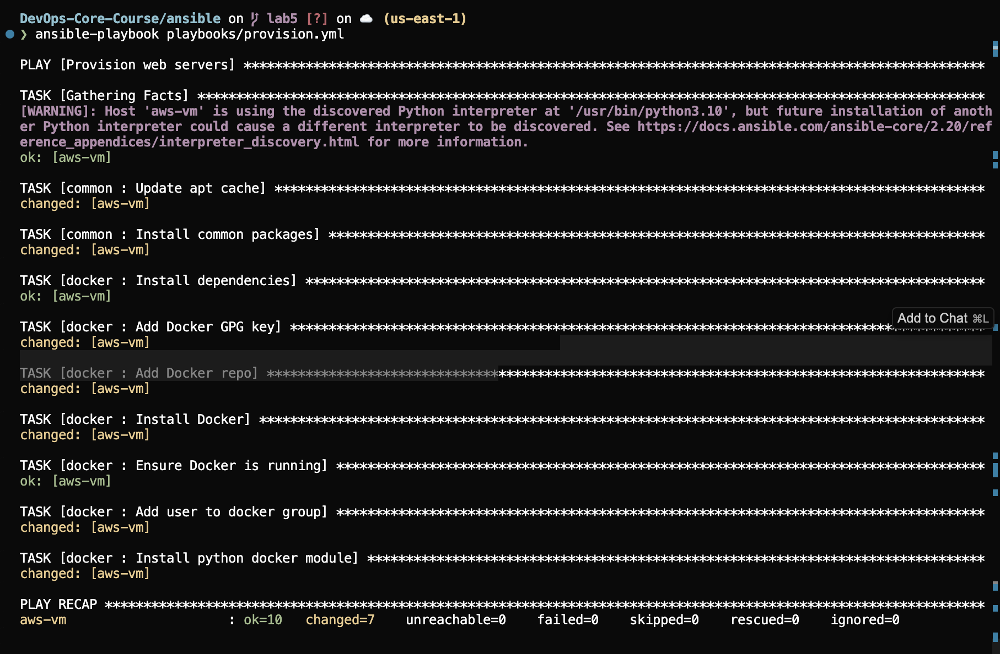
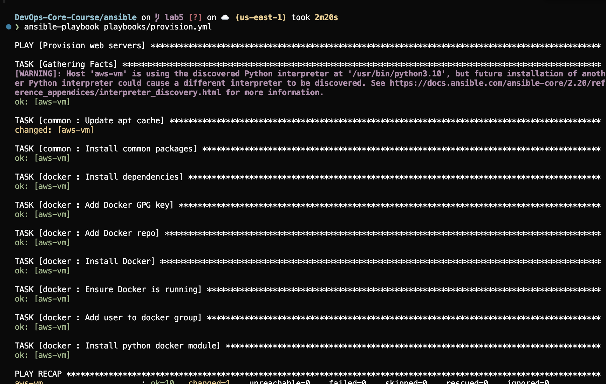
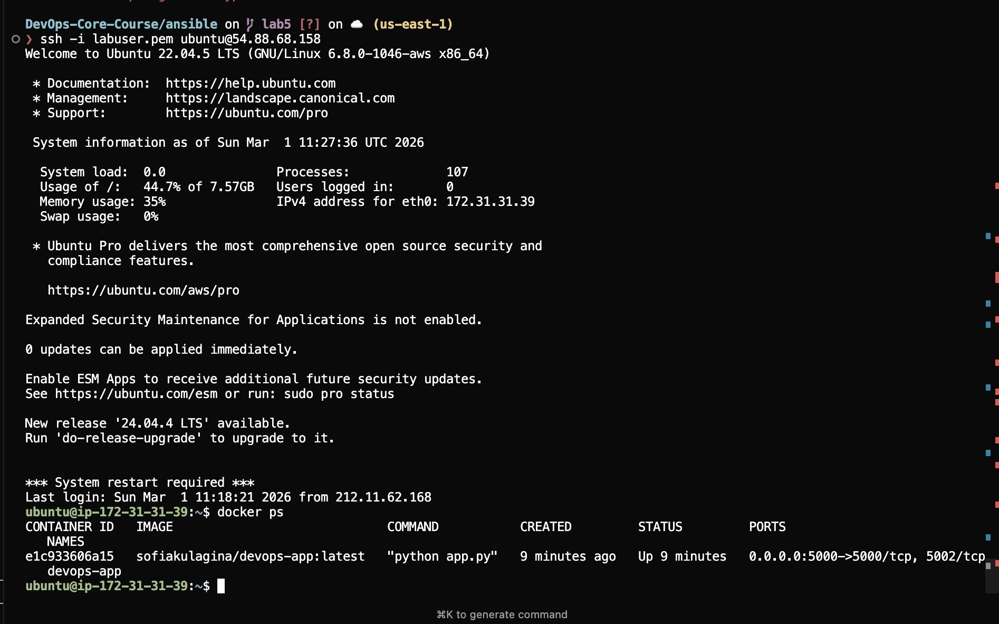
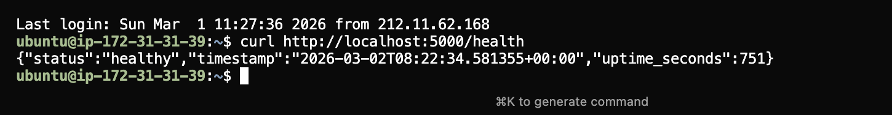
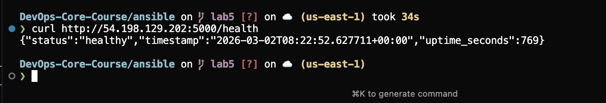

## 1. Architecture Overview

- **Ansible version**: `ansible-core 2.x` (Ansible distribution 13.x installed via Homebrew on macOS).
- **Control node**: macOS (local laptop).
- **Target VM OS**: Ubuntu 22.04.5 LTS on AWS EC2 (same VM as in previous labs).

- **Role structure**:
  - `roles/common` – base system provisioning (apt update, installation of common packages).
  - `roles/docker` – installation and configuration of Docker Engine, adding the user to the `docker` group.
  - `roles/app_deploy` – logging in to Docker Hub, pulling the application image and running the container.
  - Playbooks:
    - `playbooks/provision.yml` – applies the `common` and `docker` roles to the `webservers` group.
    - `playbooks/deploy.yml` – applies the `app_deploy` role to the `webservers` group.

- **Why roles instead of monolithic playbooks?**
  - Roles isolate responsibilities (system, Docker, app) and make reuse easier.
  - The code is cleaner: playbooks describe *which* roles to run, while the implementation details live inside the roles.
  - It is easier to test and evolve individual parts (for example, only the Docker installation).

---

## 2. Roles Documentation

### 2.1 Role `common`

- **Purpose**: base system provisioning.
  - Refresh the apt cache.
  - Install a minimal set of useful tools required by other roles and for administration.

- **Key tasks** (`roles/common/tasks/main.yml`):
  - Refresh apt cache:
    - `apt: update_cache: yes`.
  - Install packages:
    - `apt: name: "{{ common_packages }}" state: present`.

-- **Variables & defaults** (`roles/common/defaults/main.yml`):
  - `common_packages`:
    - `python3-pip`
    - `curl`
    - `git`
    - `vim`
    - `htop`

- **Handlers**: none.
- **Dependencies**: no direct role dependency, but logically this role should run before `docker` (and it is used that way in `provision.yml`).

---

### 2.2 Role `docker`

- **Purpose**: install and configure Docker on the target VM.

- **Key tasks** (`roles/docker/tasks/main.yml`):
  - Install required dependencies (`ca-certificates`, `gnupg`).
  - Add the Docker GPG key (`apt_key` with `https://download.docker.com/linux/ubuntu/gpg`).
  - Add the Docker repository for Ubuntu Jammy (`apt_repository` with `deb https://download.docker.com/linux/ubuntu jammy stable`).
  - Install Docker packages:
    - `docker-ce`, `docker-ce-cli`, `containerd.io`.
  - Ensure the Docker service is running and enabled:
    - `service: name: docker state: started enabled: true`.
  - Add user to the `docker` group:
    - `user: name: "{{ docker_user }}" groups: docker append: yes`.
  - Install the Python Docker module:
    - `apt: name: python3-docker state: present`.

- **Variables & defaults** (`roles/docker/defaults/main.yml`):
  - `docker_user: ubuntu` – the user added to the `docker` group (matches `ansible_user`).

- **Handlers** (`roles/docker/handlers/main.yml`):
  - `Restart Docker`:
    - `service: name: docker state: restarted`.
  - Used to restart Docker when configuration changes (for example, if repository or package configuration changed).

- **Dependencies**:
  - Logically depends on `common` (needs updated packages and tools), so in `provision.yml` the `common` role runs before `docker`.

---

### 2.3 Role `app_deploy`

- **Purpose**: deploy the containerized Python application from Docker Hub.

- **Key tasks** (`roles/app_deploy/tasks/main.yml`):
  - Log in to Docker Hub:
    - `community.docker.docker_login` with `dockerhub_username` and `dockerhub_password` (from Vault).
  - Pull the Docker image:
    - `community.docker.docker_image` with `name: "{{ docker_image }}"`, `tag: "{{ docker_image_tag }}"`, `source: pull`.
  - Remove any existing container:
    - `community.docker.docker_container: name: "{{ app_container_name }}" state: absent ignore_errors: yes`.
  - Run the new container:
    - `community.docker.docker_container`:
      - `name: "{{ app_container_name }}"`.
      - `image: "{{ docker_image }}:{{ docker_image_tag }}"`.
      - `state: started`.
      - `ports: "{{ app_port }}:5000"` – port mapping host:container.
      - `env: "{{ app_env }}"` – environment variables (including `PORT`).
      - `restart_policy: "{{ restart_policy }}"`.
    - `notify: restart app container` – triggers the handler when something changes.
  - Wait for the application to be ready:
    - `wait_for` on `app_port` at `127.0.0.1`, with a timeout.
  - Health check:
    - `uri: url: "http://127.0.0.1:{{ app_port }}/health" status_code: 200`.

- **Variables & defaults** (`roles/app_deploy/defaults/main.yml` + Vault):
  - Defaults:
    - `app_port: 5000`.
    - `restart_policy: unless-stopped`.
    - `app_env`:
      - `PORT: "5000"` – ensures the app inside the container listens on the same port that we expose.
  - Vault (`group_vars/all.yml`, encrypted with Ansible Vault):
    - `dockerhub_username` – Docker Hub username.
    - `dockerhub_password` – Docker Hub password or access token.
    - `app_name: devops-app`.
    - `docker_image: "{{ dockerhub_username }}/{{ app_name }}"`.
    - `docker_image_tag: latest`.
    - `app_container_name: "{{ app_name }}"`.

- **Handlers** (`roles/app_deploy/handlers/main.yml`):
  - `restart app container`:
    - `ansible.builtin.command: docker restart {{ app_container_name }}`.
  - Called only if the `Run new container` task reports changes.

- **Dependencies**:
  - Requires Docker to be installed and configured → depends on the `common` and `docker` roles (via `provision.yml`).

---

## 3. Idempotency Demonstration

- **FIRST `provision.yml` run**:
  - Screenshot: .
  - Observations:
    - Most tasks show **changed** – apt cache refresh, installation of `common` packages, Docker installation, adding the Docker repository, adding the user to the `docker` group, installing `python3-docker`.

- **SECOND `provision.yml` run**:
  - Screenshot: .
  - Observations:
    - The same tasks mostly show **ok** – packages are already installed, the repository exists, Docker is running, and the user is already in the `docker` group.

- **What changed the first time?**
  - Creating and updating the apt cache.
  - Installing the common packages (`common_packages`).
  - Installing Docker and its dependencies.
  - Adding the user to the `docker` group.
  - Installing the `python3-docker` module.

- **Why is almost everything `ok` on the second run instead of `changed`?**
  - The Ansible modules `apt`, `service`, `user`, etc. are idempotent by design:
    - `apt: state: present` does nothing if the package is already installed with the desired version.
    - `service: state: started enabled: true` makes no change if the service is already enabled and running.
    - `user: groups: docker append: yes` does not change anything if the user is already a member of `docker`.

- **What makes these roles idempotent?**
  - Using declarative state (`state: present`, `state: started`, `enabled: true`) instead of ad‑hoc shell commands.
  - Avoiding tasks that always modify the system (for example, raw `shell: apt-get install ...` without checks).
  - Relying on official Ansible modules to manage packages, users, and services.

---

## 4. Ansible Vault Usage

- **Where credentials are stored**:
  - The file `ansible/inventory/group_vars/all.yml` is encrypted with Ansible Vault.
  - It contains:
    - `dockerhub_username`.
    - `dockerhub_password`.
    - Application configuration (`app_name`, `docker_image`, `docker_image_tag`, `app_container_name`, etc.).

- **Vault password management strategy**:
  - A single Vault password was set when the file was created.
  - Playbooks use `--ask-vault-pass` at runtime so the password is never stored in the repository or shell history.
  - The password is kept locally (in memory/notes) and is **not** committed (no `vault_password_file` in the repo).

- **Example of an encrypted file**:

```text
$ANSIBLE_VAULT;1.1;AES256
3265346633643133613964363839383437663361336338373636633865623435
... (truncated) ...
```

  - The contents are fully encrypted and unreadable without the Vault password.

- **Why Ansible Vault is important**:
  - Allows storing passwords, tokens and other secrets in the same repo as playbooks without exposing them in plain text.
  - Simplifies collaboration: you can share code and encrypted files without revealing the secrets to anyone without the Vault password.
  - Meets basic security hygiene (no secrets in `git log`, diffs, or screenshots).

---

## 5. Deployment Verification

- **`deploy.yml` run**:
  - Command:
    - `ansible-playbook -i inventory/hosts.ini playbooks/deploy.yml --ask-vault-pass`.
  - Result:
    - Successful login to Docker Hub.
    - Successful pull of the image `sofiakulagina/devops-app:latest` (with `linux/amd64` support).
    - Old container (if any) removed.
    - New container started with the correct port mapping and environment variables.
    - The `restart app container` handler ran when needed.

- **Container status**:
  - Screenshot: .
  - `docker ps` output on the VM shows:
    - A container named `devops-app` (value of `app_container_name`).
    - Image `sofiakulagina/devops-app:latest`.
    - Port mapping `0.0.0.0:5000->5000/tcp`.

- **Health check verification**:
  - Screenshots:
    -  – first `curl http://<VM-IP>:5000/health` (or Ansible `uri`) call, returning HTTP 200 and a JSON body with `status: "healthy"`.
    -  – repeated health check showing stable responses.
  - This confirms that:
    - The container started successfully.
    - The application inside the container listens on the expected port (via `PORT=5000` in `app_env`).

- **Handler execution**:
  - When the container configuration changes (new image, port, env), the `Run new container` task reports `changed`.
  - This triggers the `restart app container` handler, which runs `docker restart {{ app_container_name }}`.
  - If there are no changes (subsequent `deploy.yml` runs with the same config), the handler does not run – which is also part of idempotency.

---

## 6. Key Decisions

- **Why roles instead of plain playbooks?**
  - Roles provide clear separation of concerns (system, Docker, application) and make the code easier to read.
  - They are easier to reuse across other projects and to combine in different playbooks.

- **How do roles improve reusability?**
  - Each role encapsulates one function (for example, installing Docker) with well‑defined variables and handlers.
  - The same role can be plugged into other projects by just configuring variables, without copying task files.

- **What makes a task idempotent?**
  - Using modules that describe desired state (`state: present`, `state: started`) instead of unconditional commands.
  - A task should not modify the system if it is already in the desired state – on rerun it should report `ok`, not `changed`.

- **How do handlers improve efficiency?**
  - Handlers run only when notified (i.e., when something actually changed), such as restarting Docker or a container after an update.
  - This avoids unnecessary restarts and keeps playbook runs faster and more predictable.

- **Why is Ansible Vault necessary?**
  - To store credentials (Docker Hub login/password, tokens, keys) inside the repo in encrypted form.
  - This reduces the risk of leaking secrets via GitHub, diffs, logs, or screenshots.

---

## 7. Challenges (Optional)

- **Large Terraform provider binary committed to git**:
  - Solution: remove `.terraform` from git history, add `.terraform/` to `.gitignore`, and recreate local state.

- **AWS key pair errors (`InvalidKeyPair.NotFound`) in Terraform and Pulumi**:
  - Solution: create/use an existing key pair and ensure the local `.pem` file and `key_name` in IaC match.

- **Docker Hub push and multi‑arch image issues**:
  - Solution: build the image for `linux/amd64` and retry `docker push` when network errors like `EOF`/`manifest not found` occur.

- **Ansible issues (missing vault, undefined variables)**:
  - Solution: correctly create `group_vars/all.yml` via `ansible-vault create` and use consistent variable names (`dockerhub_username`, `dockerhub_password`, etc.).


