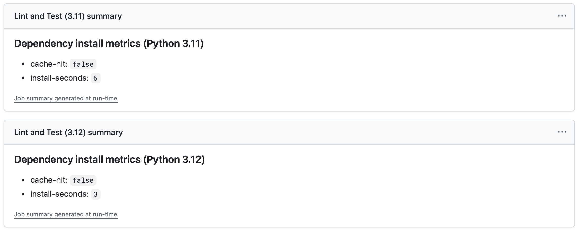
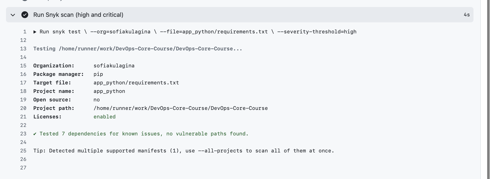
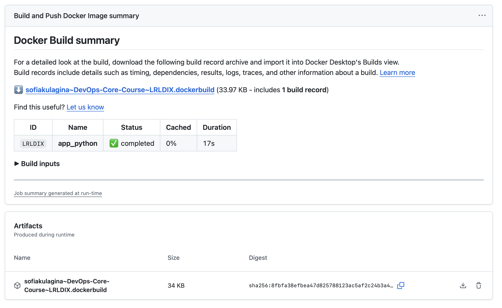

# DevOps Info Service (Lab 1)

[](https://github.com/sofiakulagina/DevOps-Core-Course/actions/workflows/python-ci.yml)

## Overview

This project implements a simple **DevOps info service** written in Python using **Flask**. The service exposes HTTP endpoints that return detailed information about the application, the underlying system, and its runtime health. It is the base for later labs (Docker, CI/CD, monitoring, persistence, etc.).

## Prerequisites

- Python 3.11+ (recommended)
- pip (Python package manager)
- Optional: `virtualenv` or `venv` for isolated environments

## Installation

```bash
python -m venv venv
source venv/bin/activate  
pip install -r requirements.txt
cp .env_example .env 
```

## Running the Application

```bash
# Default configuration (HOST=0.0.0.0, PORT=5002, DEBUG=False)
python app.py

# Custom configuration via environment variables
PORT=8080 python app.py
HOST=127.0.0.1 PORT=3000 DEBUG=true python app.py
```

## API Endpoints

- `GET /` – Service and system information
  - Service metadata (name, version, description, framework)
  - System info (hostname, platform, architecture, CPU count, Python version)
  - Runtime info (uptime, current time, timezone)
  - Request info (client IP, user agent, HTTP method, path)
  - List of available endpoints

- `GET /health` – Health check
  - Returns basic health status, timestamp, and uptime in seconds

## Configuration

Configuration is done via environment variables:

| Variable | Default     | Description                           |
|---------|-------------|---------------------------------------|
| `HOST`  | `0.0.0.0`   | Address the Flask app listens on      |
| `PORT`  | `5002`      | TCP port for HTTP server              |
| `DEBUG` | `False`     | Enable Flask debug mode if `true`     |

All configuration is read in `app.py` at startup, so restart the application after changing environment variables.

## Unit Testing

### Framework Choice

For this lab, the project uses Python `unittest`.

Short comparison:
- `pytest`: concise syntax and rich plugin ecosystem, but adds an external dependency.
- `unittest`: part of the Python standard library, no additional package required.

Why `unittest` was chosen:
- Works out of the box in minimal lab environments.
- Keeps dependencies small and predictable.
- Supports fixtures (`setUpClass`) and mocking (`unittest.mock`) needed for endpoint testing.

### Test Structure

Tests are located in `tests/test_app.py` and cover:
- `GET /` success response:
  - expected top-level JSON fields,
  - required nested fields and data types,
  - request metadata (client IP and user-agent handling).
- `GET /health` success response:
  - status, timestamp, uptime checks.
- Error responses:
  - `404` JSON error for unknown route,
  - simulated internal failures for `/` and `/health` returning JSON `500`.

### Run Tests Locally

```bash
python3 -m venv .venv
source .venv/bin/activate
pip install -r requirements.txt
python -m unittest discover -s tests -v
```

Optional coverage (standard library):

```bash
python -m trace --count --summary -m unittest discover -s tests -v
```

### Example Passing Output

```text
Ran 6 tests in 0.018s

OK
```

## Docker

How to use the containerized application (patterns):

- **Build image (local):** `docker build -t <local-name>:<tag> <path-to-app-python>`
- **Tag for Docker Hub:** `docker tag <local-name>:<tag> <username>/<repo>:<tag>`
- **Run container (local):** `docker run -p <host-port>:<container-port> --name <container-name> <image>`
- **Pull from Docker Hub:** `docker pull <username>/<repo>:<tag>`

Notes:
- The container exposes port `5002` by default (see `app.py`).
- The image runs as a non-root user for improved security.

## CI Workflow (GitHub Actions)

### Workflow Overview

Workflow file: `.github/workflows/python-ci.yml`

It runs on:
- `push` to `main` and `lab3`, and `pull_request` into `main` for lint + tests.
- `push` of SemVer git tags (`vX.Y.Z`) for Docker build and push.
- manual run via `workflow_dispatch`.

### Versioning Strategy

Chosen strategy: **Semantic Versioning (SemVer)**.

Why SemVer:
- Clear signal for breaking vs backward-compatible changes.
- Common convention for releases and container tags.

Docker tags produced on `vX.Y.Z`:
- `X.Y.Z` (full version)
- `X.Y` (rolling minor)
- `latest`

Example:
- `username/devops-info-service:1.2.3`
- `username/devops-info-service:1.2`
- `username/devops-info-service:latest`

### Secrets Required

Add these GitHub repository secrets:
- `DOCKERHUB_USERNAME`
- `DOCKERHUB_TOKEN` (Docker Hub access token)

### Release Flow

```bash
git tag v1.0.0
git push origin v1.0.0
```

The Docker job runs only on SemVer tags and pushes images with the tags above.

## CI Best Practices and Security (Task 3)

### Status Badge

The README includes a GitHub Actions badge for `.github/workflows/python-ci.yml` showing pass/fail status for `main`.

Badge and workflow link:
- Badge: `https://github.com/sofiakulagina/DevOps-Core-Course/actions/workflows/python-ci.yml/badge.svg?branch=main`
- Workflow runs: `https://github.com/sofiakulagina/DevOps-Core-Course/actions/workflows/python-ci.yml`

### Dependency Caching

Implemented in workflow via `actions/setup-python@v5`:
- `cache: pip`
- `cache-dependency-path: app_python/requirements.txt`

The workflow also writes install metrics into the Job Summary for each Python version:
- `cache-hit` (`true` or `false`)
- `install-seconds` (dependency installation time)

Measured baseline from workflow summary:
- Python 3.11: `cache-hit=false`, `install-seconds=5`
- Python 3.12: `cache-hit=false`, `install-seconds=3`

How speed improvement is measured:
1. Run workflow once after dependency change (cache miss baseline).
2. Run workflow again without changing `app_python/requirements.txt` (expected cache hit).
3. Compare `install-seconds` from Job Summary:
   `improvement_percent = ((miss_seconds - hit_seconds) / miss_seconds) * 100`

Current status:
- Baseline (miss) is recorded.
- Next run is needed to capture hit values and final percentage.

Metrics screenshot:
- Link: `docs/screenshots/metrics_lab3.png`



### Snyk Security Scanning

Integrated with `snyk/actions/setup@master` and `snyk test` CLI command in a dedicated `security` job.

Configuration:
- Secret required: `SNYK_TOKEN`
- Scan target: `app_python/requirements.txt`
- Threshold: `high` (`--severity-threshold=high`)
- Mode: non-blocking (`continue-on-error: true`) to keep visibility without blocking delivery during lab work.

If `SNYK_TOKEN` is missing, workflow prints a clear skip message.

Security results documentation:
- Latest scan status: `Succeeded`
- Scan output: `Tested 7 dependencies for known issues, no vulnerable paths found.`
- Vulnerability count: `0` (for threshold `high`)
- Vulnerability handling policy: upgrade direct dependencies first; if no fix exists, track risk in lab notes and keep non-blocking scan mode.

Snyk screenshot:
- Link: `docs/screenshots/snyk_lab3.png`



How to get `SNYK_TOKEN`:
1. Open `https://app.snyk.io`
2. Go to `Account Settings` -> `API Token`
3. Copy token and add GitHub secret:
   `Repository Settings` -> `Secrets and variables` -> `Actions` -> `New repository secret`
4. Secret name must be `SNYK_TOKEN`

### Additional CI Best Practices Applied

Implemented practices:
- **Concurrency control:** cancels outdated runs for same ref (`cancel-in-progress: true`).
- **Least-privilege permissions:** workflow-level `permissions: contents: read`.
- **Matrix testing:** tests run on Python `3.11` and `3.12`.
- **Fail-fast matrix:** stops quickly when one matrix leg fails.
- **Job dependencies:** Docker job requires successful `test` and `security` jobs.
- **Docker layer cache:** `cache-from/cache-to type=gha` for faster image builds.
- **Manual trigger:** `workflow_dispatch` for controlled reruns.
- **Timeouts:** explicit `timeout-minutes` per job to avoid stuck pipelines.

### Docker Build Evidence

From `Build and Push Docker Image` summary:
- Build status: `completed`
- Build duration: `17s`
- Docker build cache usage in that run: `0%`

Final CI/CD execution screenshot:
- Link: `docs/screenshots/artifacts_lab3.png`


