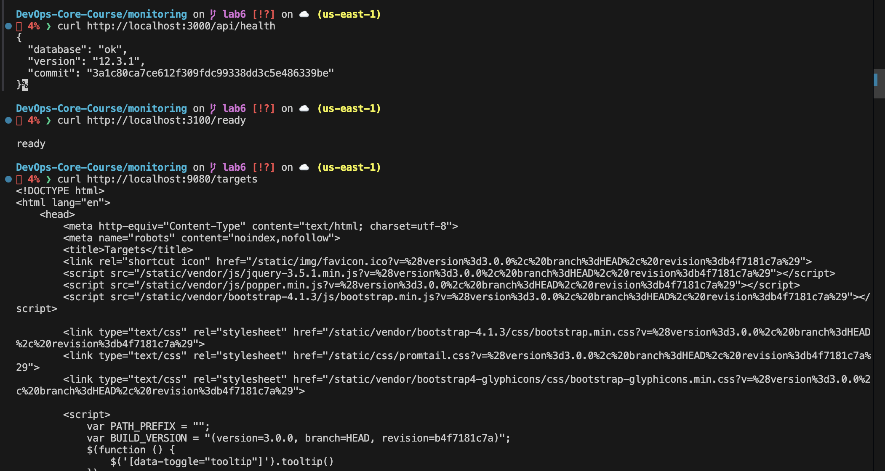
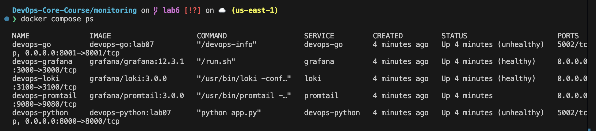
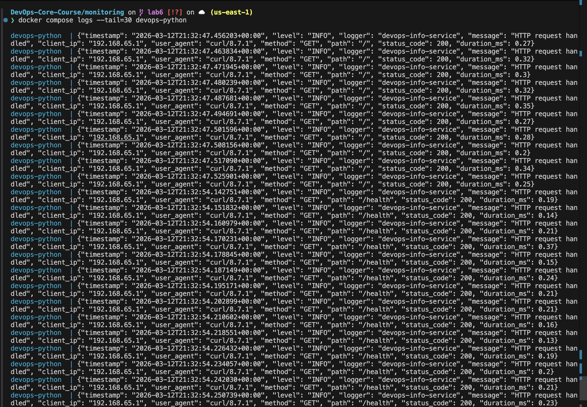
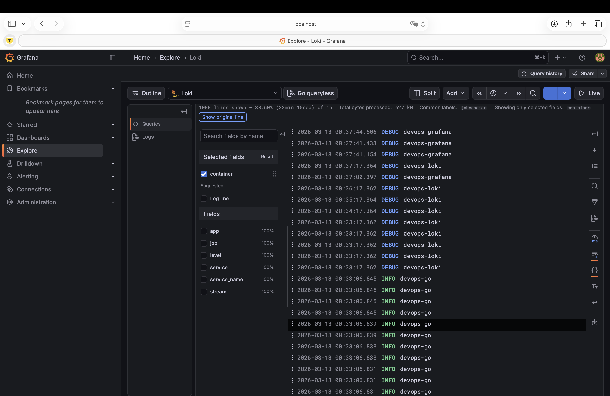
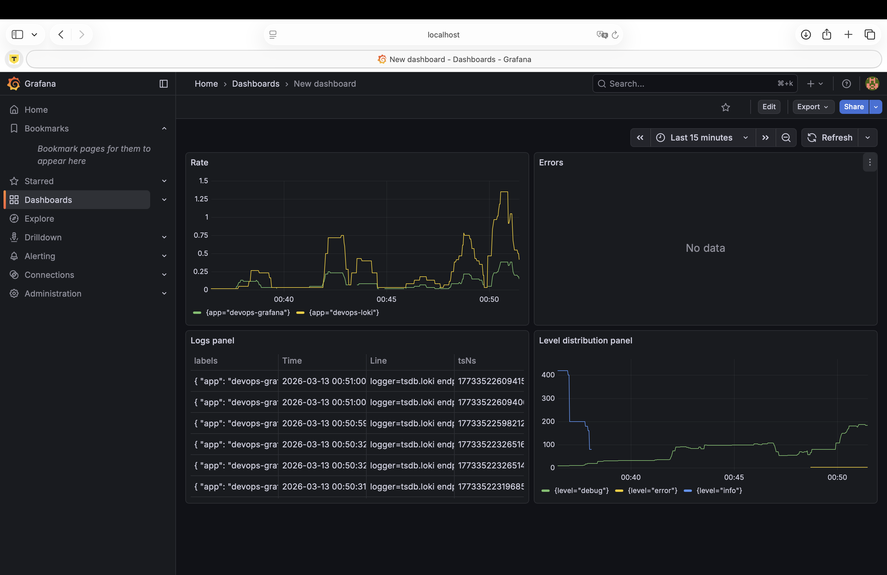
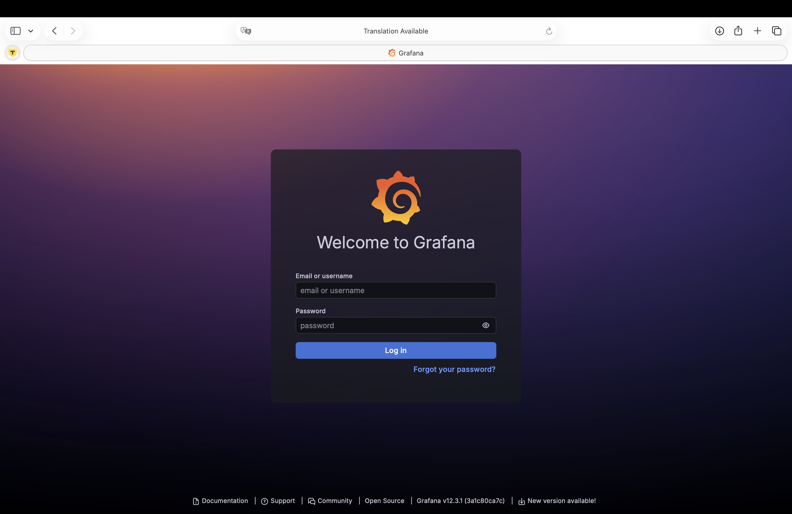

## Overview

In Lab 7, I deployed a centralized logging stack based on Loki, Promtail, and Grafana, then integrated course applications and structured JSON logs for observability.

Stack versions:

- Loki `3.0.0`
- Promtail `3.0.0`
- Grafana `12.3.1`

---

## Architecture

```text
+-------------------+          +---------------------+
| devops-python app |          | devops-go app       |
| labels:           |          | labels:             |
| logging=promtail  |          | logging=promtail    |
| app=devops-python |          | app=devops-go       |
+---------+---------+          +----------+----------+
          |                               |
          +------------- Docker logs ------+
                        (docker.sock)
                              |
                        +-----v------+
                        | Promtail   |
                        | :9080      |
                        +-----+------+
                              |
                     push logs | /loki/api/v1/push
                              v
                        +-----+------+
                        | Loki 3.0   |
                        | TSDB + FS  |
                        | :3100      |
                        +-----+------+
                              |
                        query | LogQL
                              v
                        +-----+------+
                        | Grafana    |
                        | :3000      |
                        +------------+
```

Key design choices:

- Promtail uses Docker service discovery and keeps only containers with label `logging=promtail`.
- Logs are labeled with `app`, `container`, `service`, `stream`, and `job` for efficient LogQL filtering.
- Loki stores data with TSDB schema v13 and 7-day retention.

---

## Setup Guide

1. Prepare Grafana credentials:

```bash
cd monitoring
cp .env.example .env
# edit .env and set a strong GRAFANA_ADMIN_PASSWORD
```

2. Start the full stack:

```bash
docker compose up -d --build
docker compose ps
```

3. Verify components:

```bash
curl http://localhost:3100/ready
curl http://localhost:9080/targets
curl http://localhost:3000/api/health
```

4. Open Grafana:

- URL: `http://localhost:3000`
- Login with values from `.env`

Data source is provisioned automatically from `monitoring/grafana/provisioning/datasources/loki.yml`.

---

## Configuration

### Docker Compose

File: `monitoring/docker-compose.yml`

What is configured:

- Core stack: `loki`, `promtail`, `grafana`
- App services: `devops-python`, `devops-go`
- Shared network `logging`
- Persistent volumes: `loki-data`, `grafana-data`
- Resource constraints in `deploy.resources`
- Healthchecks for Loki and Grafana
- Labels for Promtail filtering (`logging=promtail`, `app=...`)

### Loki (TSDB)

File: `monitoring/loki/config.yml`

Important settings:

- `schema_config.store: tsdb`
- `schema: v13`
- `object_store: filesystem`
- retention: `limits_config.retention_period: 168h`
- compactor retention enabled

Why this matters:

- TSDB in Loki 3.x provides better query performance and scale behavior.
- v13 schema is the expected modern schema for TSDB deployments.
- 7-day retention controls disk usage.

### Promtail

File: `monitoring/promtail/config.yml`

Important settings:

- client endpoint: `http://loki:3100/loki/api/v1/push`
- Docker SD: `docker_sd_configs` with `unix:///var/run/docker.sock`
- filter by label `logging=promtail`
- relabeling extracts `container`, `app`, `service`, `stream`
- static `job="docker"` label for baseline queries

---

## Application Logging

Python app (`app_python/app.py`) now emits structured JSON logs.

Implemented:

- custom `JsonFormatter`
- startup event logs (`event=startup`)
- request logging via `before_request` + `after_request`
- request context fields:
  - `method`
  - `path`
  - `status_code`
  - `client_ip`
  - `duration_ms`
  - `user_agent`

Example log line:

```json
{"timestamp":"2026-03-12T20:45:10.123456+00:00","level":"INFO","logger":"devops-info-service","message":"HTTP request handled","client_ip":"172.19.0.1","user_agent":"curl/8.7.1","method":"GET","path":"/health","status_code":200,"duration_ms":1.11}
```

---

## Dashboard

Create dashboard with 4 panels in Grafana:

1. Logs Table
- Query: `{app=~"devops-.*"}`
- Visualization: Logs

2. Request Rate
- Query: `sum by (app) (rate({app=~"devops-.*"}[1m]))`
- Visualization: Time series

3. Error Logs
- Query: `{app=~"devops-.*"} | json | level="ERROR"`
- Visualization: Logs

4. Log Level Distribution
- Query: `sum by (level) (count_over_time({app=~"devops-.*"} | json [5m]))`
- Visualization: Pie chart (or Stat)

Useful Explore queries:

- `{job="docker"}`
- `{app="devops-python"}`
- `{app="devops-go"}`
- `{app="devops-python"} | json | method="GET"`
- `{app="devops-python"} |= "ERROR"`

---

## Production Config

Implemented production-oriented hardening:

- Resource limits/reservations for all services
- Grafana anonymous auth disabled (`GF_AUTH_ANONYMOUS_ENABLED=false`)
- Admin password sourced from `.env` (not committed)
- Healthchecks for Loki and Grafana
- Retention policy set to 7 days in Loki

---

## Bonus Automation (Ansible)

Implemented files:

- `ansible/roles/monitoring/defaults/main.yml`
- `ansible/roles/monitoring/tasks/main.yml`
- `ansible/roles/monitoring/templates/*.j2`
- `ansible/playbooks/deploy-monitoring.yml`

What the role does:

- creates monitoring directory structure on target VM
- templates Loki/Promtail/Grafana datasource configs with Jinja2
- templates monitoring Docker Compose file
- deploys stack with `community.docker.docker_compose_v2`
- waits for Loki and Grafana health endpoints

Run commands:

```bash
cd ansible
ansible-playbook playbooks/deploy-monitoring.yml --ask-vault-pass
ansible-playbook playbooks/deploy-monitoring.yml --ask-vault-pass
```

Expected idempotency behavior:

- first run: `changed` on create/template/deploy tasks
- second run: mostly `ok` (no config drift)

---

## Testing

Generate logs:

```bash
for i in {1..20}; do curl -s http://localhost:8000/ >/dev/null; done
for i in {1..20}; do curl -s http://localhost:8000/health >/dev/null; done
for i in {1..20}; do curl -s http://localhost:8001/ >/dev/null; done
for i in {1..20}; do curl -s http://localhost:8001/health >/dev/null; done
```

Verify stack:

```bash
docker compose ps
docker compose logs --tail=20 devops-python
curl -f http://localhost:3100/ready
curl -f http://localhost:9080/targets
curl -f http://localhost:3000/api/health
```



Expected results:

- all services are `Up`
- Loki returns `ready`
- Promtail has active Docker targets
- Grafana API health returns `ok`
- Logs visible in Grafana Explore for both applications

---

## Research Notes

1. How Loki differs from Elasticsearch:
- Loki indexes labels, not full log content, so storage is typically cheaper.
- Elasticsearch indexes full text and is more expensive for high log volume.

2. What labels are and why they matter:
- Labels are metadata dimensions (for example `app`, `container`, `job`).
- They define streams and make LogQL filtering and aggregation fast.

3. How Promtail discovers containers:
- Promtail reads Docker metadata via `docker_sd_configs` and `docker.sock`.
- Relabeling maps Docker metadata to Loki labels.

---

## Challenges & Solutions

1. External access checks can fail due host firewall/security group.
- Solution: verify Loki/Promtail/Grafana locally on the Docker host with `localhost` endpoints.

2. Promtail should avoid scraping every container.
- Solution: explicit label gate `logging=promtail`.

3. Secure Grafana credentials in Compose.
- Solution: use `.env` (ignored by git) plus committed `.env.example` template.

---

## Evidence Checklist

Add screenshots to `monitoring/docs/screenshots/`:

- `json-log-output.png` (terminal output showing JSON logs from Python app)
- `explore-both-apps.png` (Grafana Explore with application logs)
- `dashboard-four-panels.png` (dashboard with all required panels)
- `compose-healthy.png` (`docker compose ps` showing healthy services)
- `grafana_login.png` (login page, no anonymous access)

### compose-healthy.png



### json-log-output.png



### explore-both-apps.png



### dashboard-four-panels.png



### grafana_login.png


