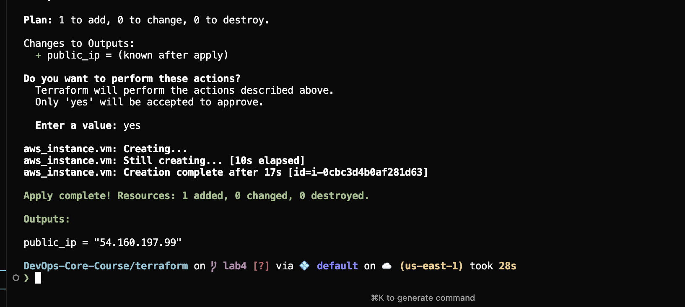
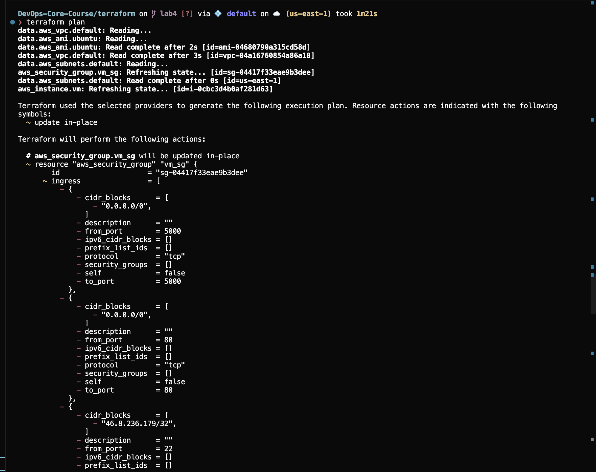
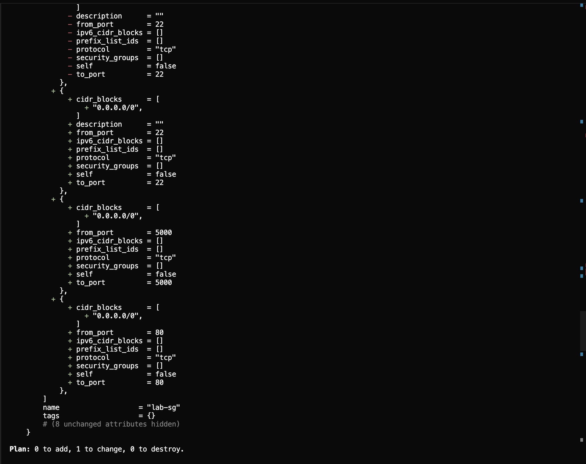
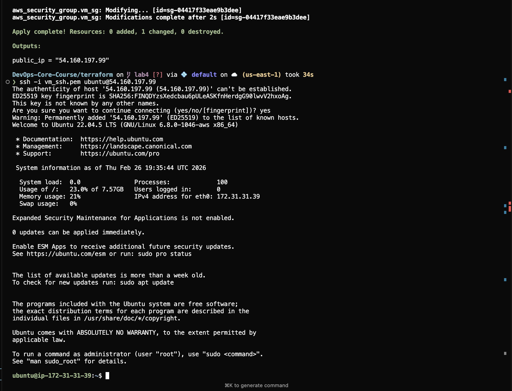
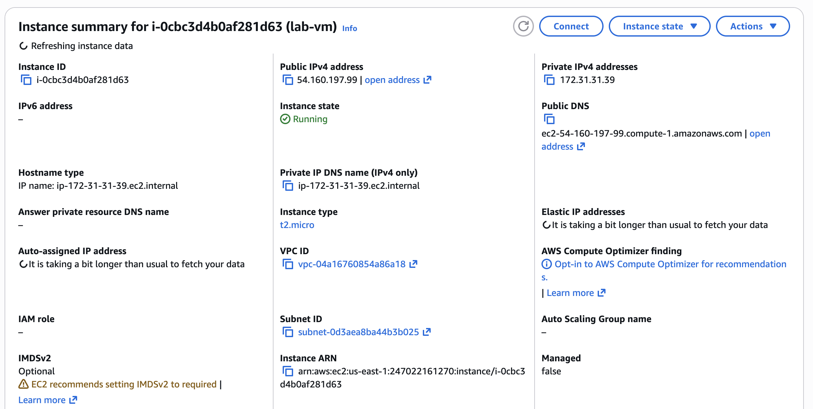
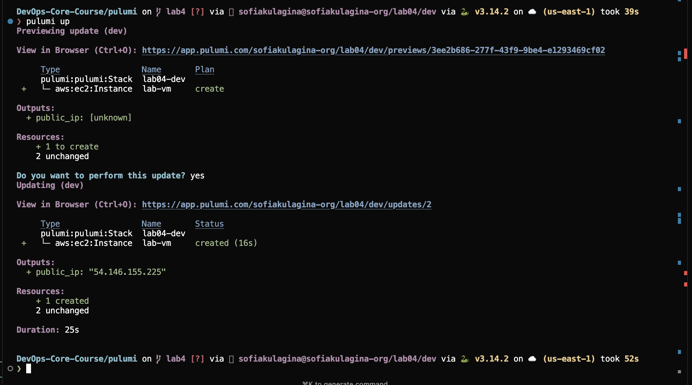
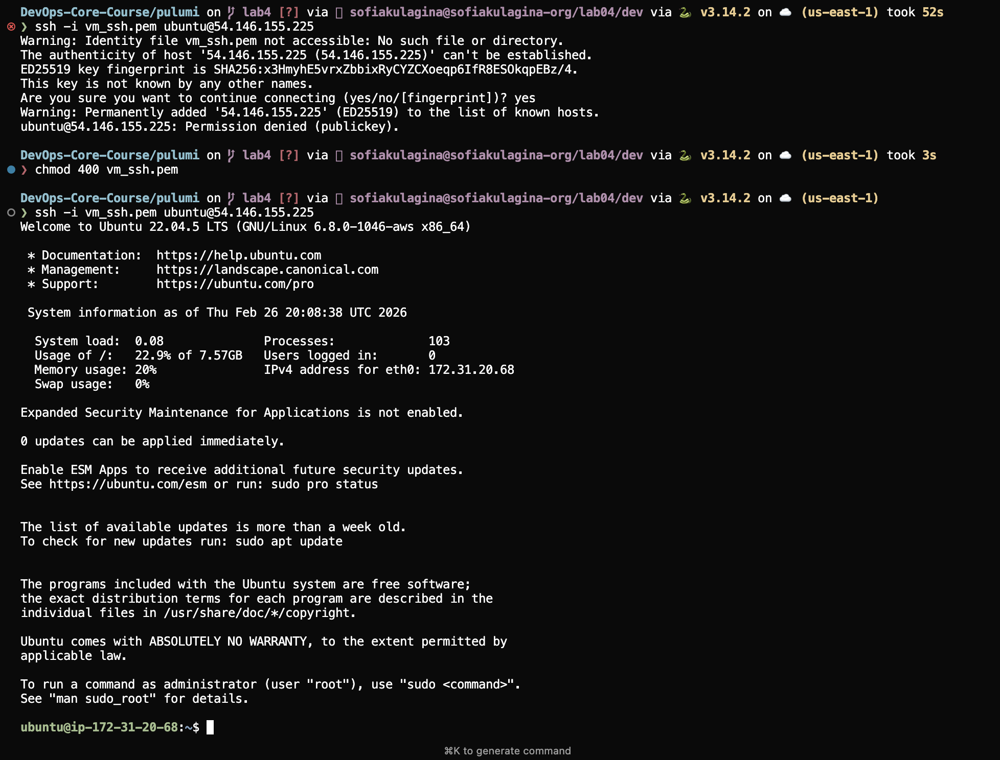
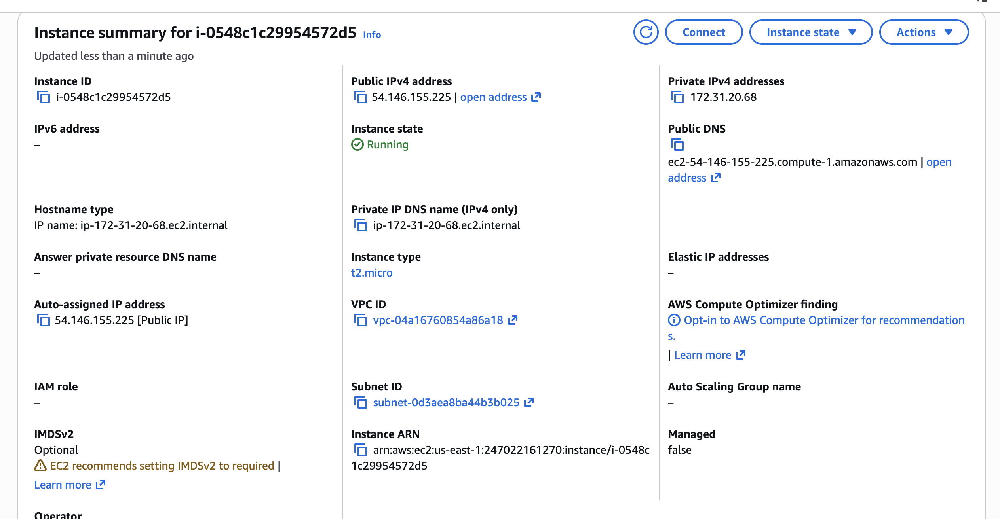

## 1. Cloud Provider & Infrastructure

- **Cloud provider**: AWS  
  - Chosen because it is the default provider for the course, we have a 50 dollars limit from university accounts, and provides a simple way to launch a single EC2 VM in the default VPC.

- **Instance type / size**: `t2.micro`  

- **Region / zone**: `us-east-1`  
  - Default region for the lab environment, widely supported with many Ubuntu AMIs, and commonly used in examples and documentation.

- **Estimated cost**:  
  - One `t2.micro` instance plus a small amount of EBS and networking. This lab workload is expected to cost **$1.5** for the whole lab session for 4 hours.

- **Resources created (Terraform / AWS)**:
  - Data sources:
    - `aws_vpc.default` – default VPC in `us-east-1`.
    - `aws_subnets.default` – subnets in the default VPC.
    - `aws_ami.ubuntu` – latest Ubuntu 22.04 AMD64 server AMI.
  - Managed resources:
    - `aws_security_group.vm_sg` – security group allowing:
      - SSH (`tcp/22`) from `0.0.0.0/0` (lab only, not production‑safe).
      - HTTP (`tcp/80`) from `0.0.0.0/0`.
      - App port (`tcp/5000`) from `0.0.0.0/0`.
    - `aws_instance.vm` – Ubuntu EC2 instance:
      - Type `t2.micro`.
      - Uses the Ubuntu AMI from `aws_ami.ubuntu`.
      - Placed in the first subnet from `aws_subnets.default`.
      - Associated with the `vm_sg` security group.
      - Uses an existing EC2 key pair (`vockey`) for SSH.
    - Output:
      - `public_ip` – the instance’s public IP address.

- **Resources created (Pulumi / AWS)**:
  - Data lookups:
    - `aws.ec2.get_vpc(default=True)` – default VPC.
    - `aws.ec2.get_subnets(...)` – subnets in that VPC.
    - `aws.ec2.get_ami(...)` – latest Ubuntu AMI.
  - Managed resources:
    - `aws.ec2.SecurityGroup("lab-sg", ...)` – same ingress/egress rules as Terraform.
    - `aws.ec2.Instance("lab-vm", ...)` – same instance shape (`t2.micro`), subnet, AMI and key pair.
    - `pulumi.export("public_ip", instance.public_ip)` – exports the VM public IP.

---

## 2. Terraform Implementation

- **Terraform version used**:

```bash
$ terraform --version
Terraform v1.5.7
on darwin_arm64
+ provider registry.terraform.io/hashicorp/aws v6.33.0
```


- **Project structure**:
  - `terraform/main.tf` – provider, data sources, security group, EC2 instance.
  - `terraform/outputs.tf` – output for `public_ip`.
  - `terraform/vm_ssh.pem` – local private key file for SSH (not managed by Terraform, used only for `ssh -i`).

- **Key configuration decisions**:
  - **Provider & region**: `provider "aws" { region = "us-east-1" }` to match the course environment.
  - **Networking**: Use the **default VPC and first subnet** via data sources instead of creating custom networking (simpler for a single‑VM lab).
  - **AMI selection**: Use a data source that fetches the latest official Ubuntu AMI owned by Canonical.
  - **Security group**: Open `22`, `80`, and `5000` to `0.0.0.0/0` for convenience in the lab; in production this would be much more restricted.
  - **Key pair**: Use an existing AWS key pair (`vockey`) for the instance and a matching local `.pem` file for SSH.

- **Challenges encountered**:
  - Initial `terraform apply` failed with `InvalidKeyPair.NotFound: The key pair 'vm_ssh' does not exist`. This happened because the instance’s `key_name` referenced a key pair that had not been created in AWS.
  - Fixed by aligning the configuration to use an existing key pair (`vockey`) and by ensuring that the local private key file had the correct permissions (`chmod 400 vm_ssh.pem`) when using SSH.
  - Also iterated on security group rules (started with a more restricted IP on port 22, then opened to `0.0.0.0/0` for simplicity).

- **Key terminal output – `terraform init`**:

```bash
$ terraform init

Initializing the backend...

Initializing provider plugins...
- Reusing previous version of hashicorp/aws from the dependency lock file
- Using previously-installed hashicorp/aws v6.33.0

Terraform has been successfully initialized!
```


- **Key terminal output – first `terraform apply` (failed due to missing key pair)**:



```bash
$ terraform apply
...
  # aws_instance.vm will be created
  + resource "aws_instance" "vm" {
      + instance_type = "t2.micro"
      + key_name      = "vm_ssh"
      ...
    }

Plan: 1 to add, 0 to change, 0 to destroy.

Do you want to perform these actions?
  Enter a value: yes

aws_instance.vm: Creating...

Error: creating EC2 Instance: ... api error InvalidKeyPair.NotFound: The key pair 'vm_ssh' does not exist
```

- **Key terminal output – successful `terraform apply`**:

```bash
$ terraform apply
...
  # aws_instance.vm will be created
  + resource "aws_instance" "vm" {
      + instance_type = "t2.micro"
      + key_name      = "vockey"
      ...
    }

Plan: 1 to add, 0 to change, 0 to destroy.

Do you want to perform these actions?
  Enter a value: yes

aws_instance.vm: Creating...
aws_instance.vm: Creation complete after 17s [id=i-0cbc3d4b0af281d63]

Apply complete! Resources: 1 added, 0 changed, 0 destroyed.

Outputs:

public_ip = "<TERRAFORM_VM_PUBLIC_IP>"
```

- **Key terminal output – `terraform plan` after initial apply (security group change)**:


```bash
$ terraform plan
...
Terraform will perform the following actions:

  # aws_security_group.vm_sg will be updated in-place
  ~ resource "aws_security_group" "vm_sg" {
      ~ ingress = [
          - ... previous rules ...
          + ... updated rules for ports 22, 80, 5000 from 0.0.0.0/0 ...
        ]
    }

Plan: 0 to add, 1 to change, 0 to destroy.
```

- **Key terminal output – SSH connection to Terraform VM**:

```bash
$ ssh -i vm_ssh.pem ubuntu@<TERRAFORM_VM_PUBLIC_IP>
The authenticity of host '<TERRAFORM_VM_PUBLIC_IP> (<TERRAFORM_VM_PUBLIC_IP>)' can't be established.
...
Welcome to Ubuntu 22.04.5 LTS (GNU/Linux 6.8.0-1046-aws x86_64)
...
ubuntu@ip-172-31-31-39:~$ exit
Connection to <TERRAFORM_VM_PUBLIC_IP> closed.
```



---

## 3. Pulumi Implementation

- **Pulumi version and language**:
  - Language: **Python**.
  - Tooling:
    - Pulumi Python SDK: `pulumi 3.224.0`.
    - AWS provider SDK: `pulumi-aws 7.20.0`.
    - Python version: `3.14.2` (via Poetry virtualenv).
    - CLI used via `pulumi preview` / `pulumi up` in the `pulumi` directory.

- **Project structure**:
  - `pulumi/__main__.py` – main Pulumi program defining the stack, security group, and EC2 instance, and exporting `public_ip`.
  - Pulumi configuration & state:
    - Stack name: `lab04-dev`.
    - Organization: `sofiakulagina-org`.
    - Region: `us-east-1` (configured via Pulumi config).

- **How the Pulumi code differs from Terraform**:
  - Terraform uses **HCL** (a declarative DSL), while Pulumi uses **general-purpose Python code**.
  - Data sources in Terraform (`data "aws_vpc"`, `data "aws_subnets"`, `data "aws_ami"`) become **Python function calls** (`aws.ec2.get_vpc`, `aws.ec2.get_subnets`, `aws.ec2.get_ami`).
  - Resources are defined as **Python objects** (`aws.ec2.SecurityGroup(...)`, `aws.ec2.Instance(...)`) instead of HCL blocks.
  - Outputs are exported via `pulumi.export("public_ip", instance.public_ip)` instead of an `output` block.
  - Because it is Python, it can use normal control flow, loops, and functions to structure infrastructure logic.

- **Advantages discovered with Pulumi**:
  - **Single language**: You can stay in Python for both application and infrastructure code, which makes reuse and abstraction easier.
  - **Rich IDE support**: Autocomplete, type hints, and refactoring tools from the Python ecosystem help catch mistakes early.
  - **Familiar control flow**: Using regular `if` statements, lists, and functions is more natural than some of Terraform’s declarative constructs.
  - **Consistent preview / up experience** similar to Terraform’s plan / apply, but with additional integration into the Pulumi web UI.

- **Challenges encountered**:
  - Hit the **same key pair error** as with Terraform: `InvalidKeyPair.NotFound: The key pair 'vm_ssh' does not exist`, because the Pulumi program also initially referenced a non‑existent key pair.
  - Needed to align the Pulumi configuration with an actual AWS key pair and ensure the local `.pem` file permissions were correct (`chmod 400 vm_ssh.pem`).
  - First `pulumi up` was intentionally cancelled (`Do you want to perform this update? no`) while reviewing the plan, then re-run to actually create resources.

- **Key terminal output – `pulumi preview`**:

```bash
$ pulumi preview
Previewing update (dev)

     Type                      Name       Plan
 +   pulumi:pulumi:Stack       lab04-dev  create
 +   ├─ aws:ec2:SecurityGroup  lab-sg     create
 +   └─ aws:ec2:Instance       lab-vm     create

Outputs:
    public_ip: [unknown]

Resources:
    + 3 to create
```

- **Key terminal output – `pulumi up`**:


```bash
$ pulumi up
Previewing update (dev)
...
Do you want to perform this update? yes
Updating (dev)

     Type                 Name       Status
     pulumi:pulumi:Stack  lab04-dev
 +   └─ aws:ec2:Instance  lab-vm     created (16s)

Outputs:
  + public_ip: "<PULUMI_VM_PUBLIC_IP>"

Resources:
    + 1 created
    2 unchanged
```

- **Key terminal output – SSH connection to Pulumi VM**:

```bash
$ ssh -i vm_ssh.pem ubuntu@<PULUMI_VM_PUBLIC_IP>
Welcome to Ubuntu 22.04.5 LTS (GNU/Linux 6.8.0-1046-aws x86_64)
...
ubuntu@ip-172-31-20-68:~$
```

---

## 4. Terraform vs Pulumi Comparison

- **Ease of learning**:  
  Terraform felt easier to learn initially because most introductory infrastructure‑as‑code material and examples use Terraform and its HCL syntax. The mental model of “write HCL → run `terraform plan` → run `terraform apply`” is very straightforward. Pulumi adds some extra concepts (stacks, organizations, SDKs, language runtimes), which is powerful but slightly more to absorb at the beginning. Overall, for a brand‑new IaC user, Terraform had a gentler learning curve in this lab.

- **Code readability**:  
  For simple resources, Terraform’s HCL is very concise and easy to scan, especially when describing static infrastructure like one EC2 instance and one security group. As the configuration grows, being able to use Python in Pulumi may become more readable because you can refactor into functions, classes, and modules. In this lab, both were readable, but Terraform felt more compact while Pulumi felt more expressive.

- **Debugging experience**:  
  Both tools surfaced clear AWS error messages (for example, the `InvalidKeyPair.NotFound` error). Terraform’s CLI output is very linear and easy to follow when something fails during `apply`. Pulumi’s output is similar but also ties into a web UI that can provide additional context about failed resources. In this exercise, debugging the key pair issue was about equally easy in both tools because the underlying AWS error was explicit.

- **Documentation and examples**:  
  Terraform has a huge amount of documentation and community examples for AWS, which makes it easy to find snippets for common patterns (VPCs, security groups, EC2 instances, etc.). Pulumi also has good docs, but examples are spread between languages and sometimes require more navigation to find exactly the Python version of what you need. For this lab, Terraform’s docs felt slightly more direct and aligned with common AWS tutorials.

- **Use cases / when to use which**:  
  Terraform is a great fit when teams want a **cloud‑agnostic, declarative DSL** with a massive ecosystem and when most infrastructure can be described as relatively static configuration. Pulumi shines when infrastructure needs to be **deeply integrated with application code**, benefit from reuse and abstraction in a general‑purpose language, or when engineers are already very comfortable in languages like Python or TypeScript. After this lab, Terraform feels ideal for straightforward infrastructure modules, while Pulumi feels attractive for larger, more programmatic environments where shared libraries and higher‑level abstractions are valuable.

## 5. Lab5 Preparation & Cleanup

i am keeping my vms bot terraform and pulumni created running. The status shown in picture higher.